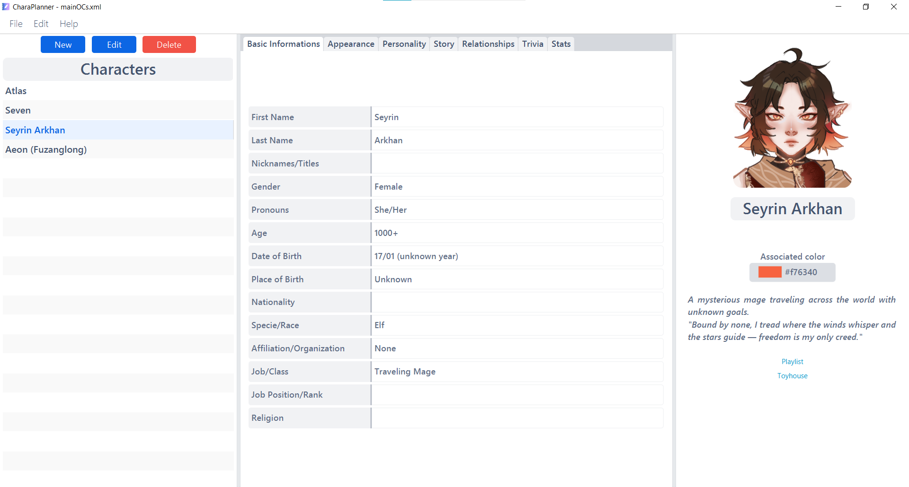
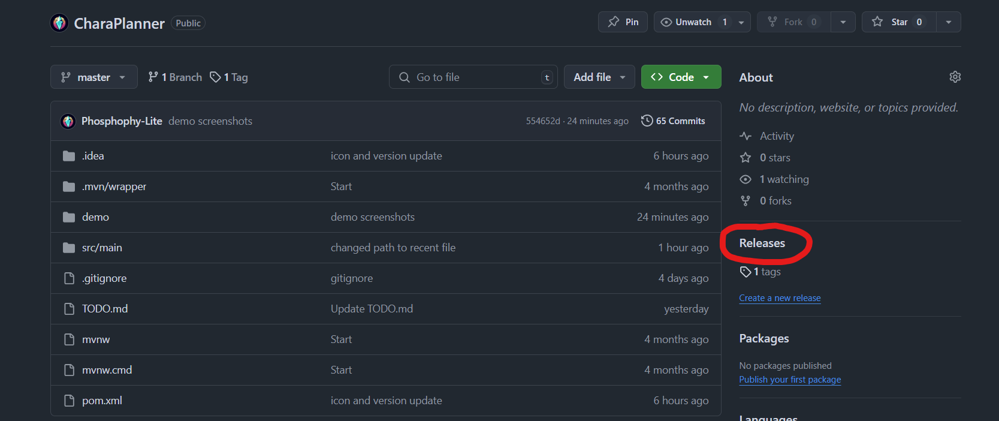
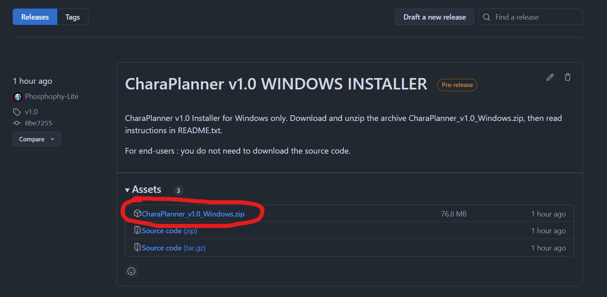
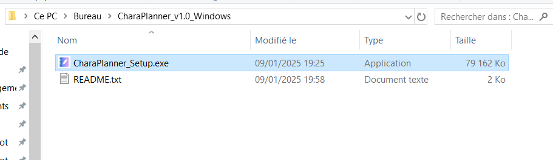

<!-- PROJECT LOGO -->
 

  

  <h3 align="center">CharaPlanner</h3>

  

    Create, edit and store sheets for your Original Characters
     
    <a href="https://github.com/Phosphophy-Lite/CharaPlanner/issues/new?labels=bug&template=bug-report---.md">Report Bug</a>
    &middot;
    <a href="https://github.com/Phosphophy-Lite/CharaPlanner/issues/new?labels=enhancement&template=feature-request---.md">Request Feature</a>
  

<!-- ABOUT THE PROJECT -->
## About the Project

CharaPlanner aims to provide an efficient way to create, edit and store original character (OC) sheets for writers, artists, roleplayers, etc.  
You can create and save databases to store multiple characters : each database will come as a .xml format file to save anywhere on your computer.
CharaPlanner only reads its own XML formatted files.
 
 
This application is a personal educational project created to help me learn Java and JavaFX. 
It is not intended for commercial use and may undergo further development in the future.

### Built With

* 
* **JDK**: OpenJDK 21.0.5
* **JRE**: OpenJDK 21.0.5

## Installation

### Windows

1. Go to Releases and find the latest version for Windows

2. In Assets, download the .zip archive <b>"CharaPlanner_{version}_Windows"</b> of the latest version. No need to download other directories.

3. Unzip the archive and execute <b>CharaPlanner_Setup.exe</b> 
4. Follow the steps of the installer, and you're done!

### Any OS (not recommended for Windows as it's more complex to run than the installer)

1. Go to Releases and find the latest version marked as "JAR FILE (any OS)" 
2. In Assets, download the .zip archive <b>"CharaPlanner_{version}_Windows"</b> of the latest version. No need to download other directories.
3. Unzip the archive and <b>FOLLOW INSTRUCTIONS INSIDE README.txt</b>. You will need to <b>install OpenJDK 21.0.5</b> and <b>execute CharaPlanner.jar with OpenJDK</b> otherwise it won't work. The steps are detailed in the README.txt. 
4. Each time you will execute the app, the steps to execute the .jar file with OpenJDK will be necessary to follow.

<!-- CONTRIBUTING -->
## Contributing

Any contributions are greatly appreciated as I'm still learning JavaFX development and my code is far from perfect.
If you have a suggestion that would make this better, please fork the repo and create a pull request, or open an issue with the tag "enhancement".
